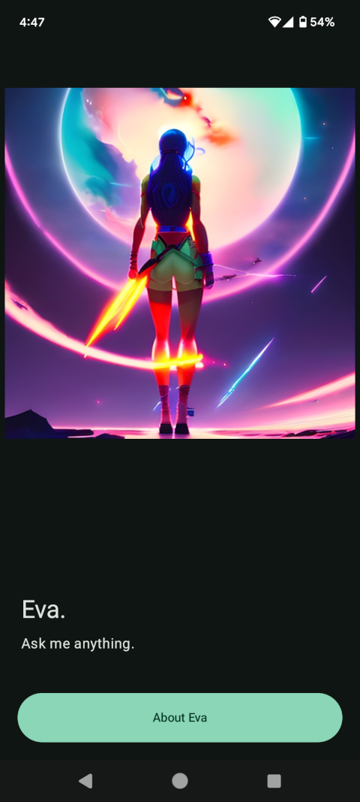
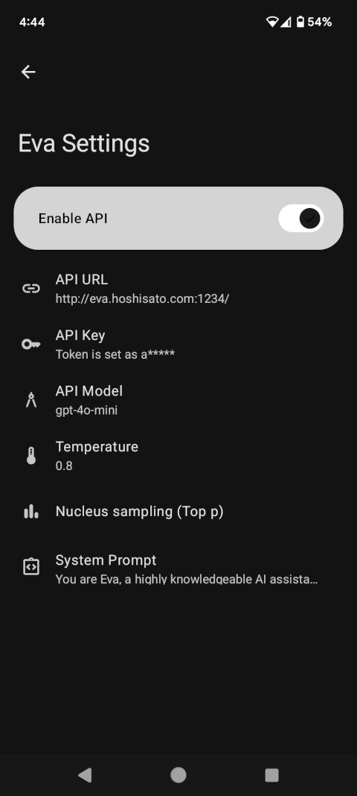
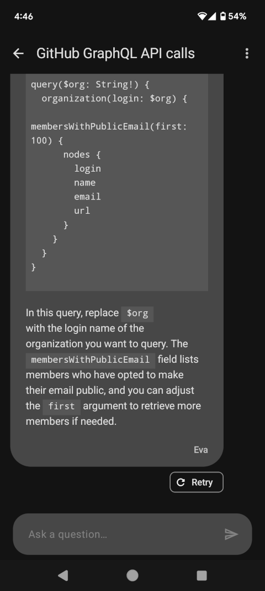

## Eva 

 <p>

Eva was built on top of [GPT Mobile](https://github.com/Taewan-P/gpt_mobile) taking advantage of ```local/custom``` Server Endpoint APIs.

## License

GPL-3

### Screenshots
&emsp;&emsp;
